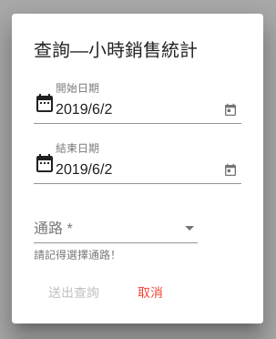
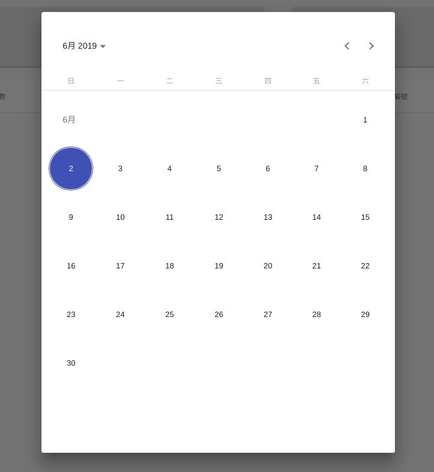

查詢新報表
===========

查詢按鈕
.........

.. image:: ./_static/query1.png
    :height: 80 px
    :align: right

| 每個報表頁面均有一個 **查詢按鈕**。
| 開啟 **查詢頁面** 的按鈕位於整體主畫面的右下角。
| 點選按鈕之後可開啟相對應的查詢選單。
|

查詢頁面說明
.............

| 選單開啟後，每個選單最基本的就是有 **開始日期** 與 **結束日期** 。
|
| 日期欄位直接點選，要以文字輸入更改日期。
| 如須使用 **日期選擇器** ，請點選欄位後面的日期圖示。
|
| 特權用戶可查詢多的通路者，會有通路選項。
| **請務必選擇通路才可送出**
|
|
|
|

日期選擇器說明
..............

| 新版日期選擇器，為全螢幕模式。方便手機使用。
|
| 日期選擇方式，為直接點選要選擇日期即可。
